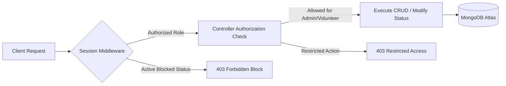

# 🩸 BloodHero — Modern Blood Donation & Management Platform

BloodHero is a high-performance, full-stack blood donation ecosystem built using Next.js and Node.js. It bridges the gap between blood donors, volunteers, and recipients by providing real-time request tracking, multi-role dashboard controls, secure location-based filtering, and integrated fund management.

  
  
  
  
  

---

## 🔗 Quick Links

- 🌍 **Live Application:** [bloodhero-client.vercel.app](https://blood-hero-client.vercel.app)
- 💻 **Client Repository:** [bloodhero-client](https://github.com/mdshantosharker/BloodHero-Client)
- 🧠 **Server Repository:** [bloodhero-server](https://github.com/mdshantosharker/BloodHero-Server)

---

## 🔥 Core Capabilities

### 🔀 Multi-Role Architecture (RBAC)

- **🩸 Donors (Default):** Register with blood group, district, and upazila parameters. Can create, edit, delete, and view their own donation requests with state-driven pagination and filters.
- **🤝 Volunteers:** Manage and view all global donation requests, with strict permission safety enabling them to update status logs (`pending` ➔ `inprogress` ➔ `done` / `canceled`) while blocking administrative modifications.
- **🌐 Admins:** Absolute oversight. Toggle user permissions, block/unblock users via conditional state rules, manage platform funds, and fully control all global blood requests.

### 🔐 Route Security & State Pipeline

- **State Guarded Routes:** High-security private route authorization syncing context scopes with local session states inside Next.js. Employs optimized lifecycle hydration ensuring hard refreshes on private routes do not force-redirect active users.
- **Credential Mitigation:** Critical infrastructure tokens, API endpoints, and runtime keys are abstracted securely into server/client environment configurations, neutralizing credential leakage.

### 💼 Automation & Request Locks

- **Atomic Concurrency Locks:** Once an active donor confirms a donation, the platform updates the query dynamically from `pending` to `inprogress`, logging donor metadata and shielding the request from double-booking race conditions.
- **Location-Aware Query Engine:** Custom search pipelines evaluating Bangladesh Geocode parameters (Blood Group + District + Upazila) to return instantly matched, actionable donor datasets.

---

## 🛠️ Tech Stack & Micro-Dependencies

| Layer        | Technology             | Key Libraries                                                         |
| :----------- | :--------------------- | :-------------------------------------------------------------------- |
| **Frontend** | Next.js / Tailwind CSS | `framer-motion`, `lucide-react`, `stripe-js`, `axios`, `lottie-react` |
| **Backend**  | Node.js / Express.js   | `dotenv`, `cors`, `cookie-parser`, `stripe`                           |
| **Database** | MongoDB Atlas          | Mongoose, Native Arrays, Aggregation Framework (Stats Engine)         |

---

## ⚙️ System Behavior & Core Logic

### 🛡️ Core Authentication & Workflow Pipeline

- **Image Hosting Engine:** Registration workflows integrate ImgBB API pipelines to handle dynamic multi-part avatar uploads asynchronously before state registration.
- **Safe State Profiles:** Profile settings load interactive, locked inputs by default. Activating the "Edit" context enables mutation buffers, while native identity vectors like email strings remain permanently static.
- **Fail-Fast Safety Checks:** Private API endpoints run sequential session and role verification checks before rendering sensitive data streams to client handlers.

### 🧪 Database Optimization & Queries

- **Case-Insensitive Dynamic Searching:** Donor lookup queries process multiple optional conditions utilizing optimized backend string filters.
- **Stripe Transaction Ledger:** Funds raised are processed through atomic payment endpoints, rendering detailed records (`Donor Name`, `Amount`, `Timestamp`) into the database for real-time aggregation metrics.
- **State Aggregation Pipeline:** Admin dashboard metrics avoid repeated heavy queries by running centralized multi-facet aggregations to compute live application statistics efficiently.

---

## 📡 Backend Architecture Flow

